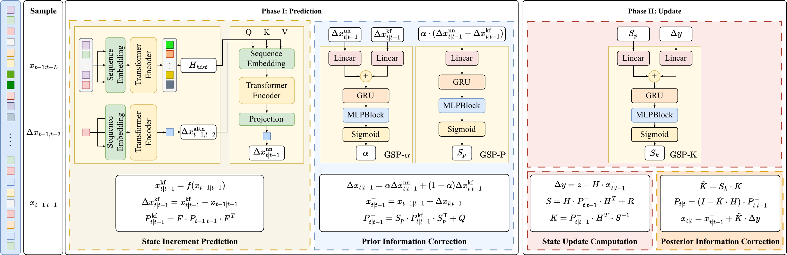

<h1 align="center">Diff-Kalman</h1>

<h3 align="center">
Difference-Driven Learning for Structure-Preserving Kalman Filtering
</h3>

  <strong>NeurIPS 2026 Main Track · Poster</strong>

  
  

  <a href="https://github.com/heu-gj/Diff-Kalman"><b>Repository</b></a>

---

## TL;DR

> **Diff-Kalman** is a hybrid Kalman-style filtering framework that introduces **difference-driven corrections** in both the prediction and update phases while preserving the recursive predict-update structure.

  

  <em>Overview of the Diff-Kalman framework.</em>

## News

- **Sep. 2026** — Diff-Kalman was accepted to the **NeurIPS 2026 Main Track** as a poster.
- **Code release** — The implementation is being cleaned and documented for public release.

## Highlights

- **Difference-driven prediction.** A Transformer models historical states and first-order differences to predict a neural state increment.
- **Model-data fusion.** GSP-α fuses the neural increment with the model-based increment instead of replacing the dynamic model.
- **Structured filtering corrections.** GSP-P calibrates model-propagated uncertainty, while GSP-K corrects the Kalman gain through structured scaling.

## Method

Diff-Kalman retains a recursive Kalman-style prediction-update structure and introduces learned corrections in both phases.

| Phase | Component | Role |
|:--|:--|:--|
| **Prediction** | Transformer | Predicts a neural state increment from historical states and first-order differences. |
| **Prediction** | GSP-α | Fuses the neural and model-based state increments. |
| **Prediction** | GSP-P | Calibrates the model-propagated uncertainty while preserving its positive-semidefinite form. |
| **Update** | GSP-K | Corrects the Kalman gain using the innovation and prior uncertainty. |

## Experiments

The current manuscript evaluates Diff-Kalman on linear and nonlinear state-estimation settings.

| Setting | Dataset / System | Focus |
|:--|:--|:--|
| Linear | **MOT17 trajectories** | Motion state estimation |
| Nonlinear | **Lorenz dynamics** | Nonlinear and chaotic state estimation |

The paper also includes comparisons with classical and learning-based filtering methods, together with ablation and robustness studies.

> Camera-ready experiments and the corresponding reproduction scripts will be reflected here with the public code release.

## Code Release

We are preparing the repository for a reproducible public release.

| Item | Status |
|:--|:--:|
| Project repository | ✅ |
| NeurIPS 2026 acceptance information | ✅ |
| Environment and dependencies | ⏳ |
| Training code | ⏳ |
| Evaluation code | ⏳ |
| Dataset preparation | ⏳ |
| Experiment configurations | ⏳ |
| Pretrained checkpoints | ⏳ |
| Table / figure reproduction scripts | ⏳ |

## Installation

Coming soon.

The current experiments use **Python 3.10**, **PyTorch 2.5.1**, and **CUDA 12.1**.

## Data Preparation

Dataset download and preprocessing instructions will be provided for each experiment at release.

## Training & Evaluation

Training commands, evaluation commands, experiment configurations, and pretrained checkpoints will be added with the public code release.

## Reproducing the Paper

We plan to provide dedicated scripts or configurations for reproducing the main tables and figures in the camera-ready paper.

## Citation

If you find this work useful, please consider citing our paper. BibTeX will be added after the camera-ready metadata is finalized.

## License

License information will be added with the public code release.

## Contact

For questions about the paper, implementation, or reproducibility, please open an issue in this repository.
